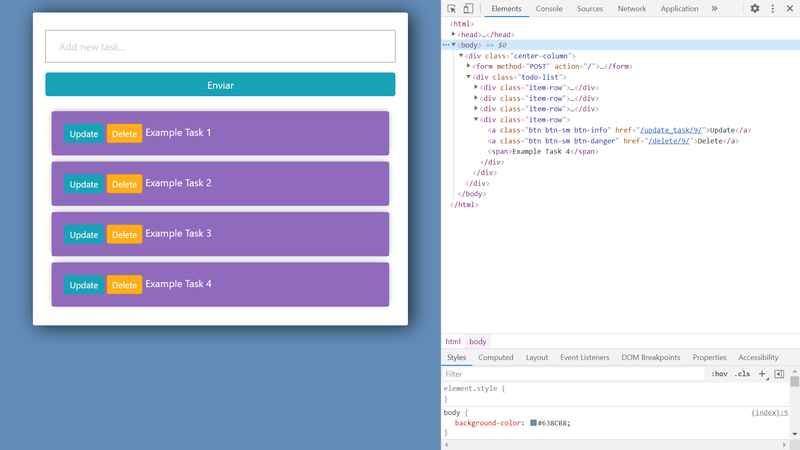

# :zap: Python Django Todo

* Python-Django CRUD (Create, Read, Update & Delete) app to manage todo tasks
* Code from a tutorial by [Dennis Ivy](https://www.youtube.com/channel/UCTZRcDjjkVajGL6wd76UnGg) - see [:clap: Inspiration](#clap-inspiration) below

## :page_facing_up: Table of contents

* [:zap: Python Django Todo](#zap-python-django-todo)
  * [:page_facing_up: Table of contents](#page_facing_up-table-of-contents)
  * [:books: General info](#books-general-info)
  * [:camera: Screenshots](#camera-screenshots)
  * [:signal_strength: Technologies](#signal_strength-technologies)
  * [:floppy_disk: Setup](#floppy_disk-setup)
  * [:computer: Code Examples](#computer-code-examples)
  * [:cool: Features](#cool-features)
  * [:clipboard: Status & To-do list](#clipboard-status--to-do-list)
  * [:clap: Inspiration](#clap-inspiration)
  * [:envelope: Contact](#envelope-contact)

## :books: General info

* User can add todo tasks to a list and then update or delete items
* Styling done using Bootstrap

## :camera: Screenshots



## :signal_strength: Technologies

* [Python v3](https://www.python.org/) programming language
* [Django v3](https://www.djangoproject.com/) server-side web framework
* [Bootstrap v4](https://getbootstrap.com/)

## :floppy_disk: Setup

* [Install Python](https://docs.python-guide.org/starting/installation/)
* [Install pip](https://docs.python-guide.org/dev/virtualenvs/#installing-pipenv)
* [Install Django](https://docs.djangoproject.com/en/3.1/howto/windows/) by typing `pip install Django`
* Run `django-admin startproject example_proj` to create a new project [ref. docs](https://docs.djangoproject.com/en/3.1/intro/tutorial01/)
* Open `example_proj` in VS Code
* Run `python manage.py startapp new_module` to create Python module
* Add code
* Run `pip freeze` to see list of modules installed. [Ref. Docs](https://pip.pypa.io/en/stable/reference/pip_freeze/)
* Run `python manage.py makemigrations` for changes to models etc.
* Run `python manage.py migrate` to migrate the migration files.
* For Admin panel: to add a superuser Run `python manage.py createsuperuser --username=joe --email=joe@example.com` [Ref. Docs](https://docs.djangoproject.com/en/3.1/topics/auth/default/)
* Run `python manage.py runserver` to run server on port 8000 and open /admin console

## :computer: Code Examples

* extract from `tasks/views.py`: task update method

```python
def updateTask(request, pk):
  task = Task.objects.get(id=pk)

  form = TaskForm(instance=task)

  if request.method == 'POST':
    form = TaskForm(request.POST, instance=task)
    if form.is_valid():
      form.save()
      return redirect('/')

  context = {'form':form}

  return render(request, 'tasks/update_task.html', context)
```

## :cool: Features

* Bootstrap styling

## :clipboard: Status & To-do list

* Status: Working
* To-do: Work out how to add Bootstrap to each template page but only import once. Add styling to delete and update pages. Add backend database.

## :clap: Inspiration

* [Dennis Ivy: To Do App | Django 3.0](https://www.youtube.com/watch?v=4RWFvXDUmjo)

## :envelope: Contact

* Repo created by [ABateman](https://www.andrewbateman.org) - you are welcome to [send me a message](https://andrewbateman.org/contact)
